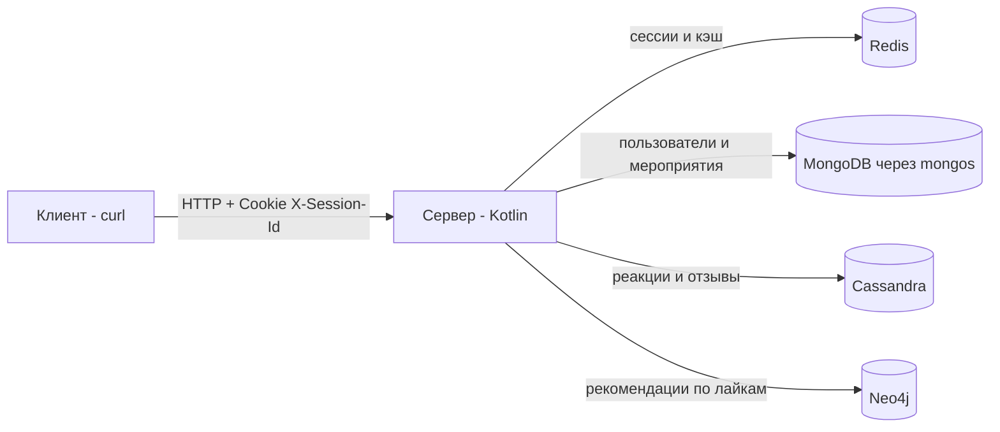

# EventHub

## Резюме

Проект представляет собой учебный backend-сервис для платформы мероприятий. В финальном состоянии сервис объединяет базовый healthcheck, анонимные и авторизованные сессии на Redis, регистрацию и аутентификацию пользователей, создание и поиск мероприятий в MongoDB, редактирование мероприятий и поиск организаторов, реакции и отзывы на Cassandra с кэшированием в Redis, а также рекомендации мероприятий на Neo4j. 

Содержание:

- [Цель проекта](#Цель-проекта)
- [Структура проекта](#структура-проекта)
- [Зависимости и инструменты](#зависимости-и-инструменты)
- [Сборка, запуск и конфигурация](#сборка-запуск-и-конфигурация)
- [API](#api)

## Цель проекта

Постепенное освоение NoSQL, путем имплементации нескольких NoSQL-хранилищ в единый сервис. 

Основные хранилища и их назначение:

- Redis — анонимные и пользовательские сессии, кэш реакций, кэш отзывов и кэш рекомендаций.
- MongoDB — пользователи и мероприятия.
- Cassandra — реакции и отзывы.
- Neo4j — граф лайков для построения рекомендаций.

Ниже показана упрощённая схема взаимодействия компонентов.



## Структура проекта


```text
nosqlDB/
├── .env.local
├── .github/
│   ├── scripts/lab_number.sh
│   └── workflows/eventhub.yml
├── .labrc
├── CHANGELOG.md
├── CODEOWNERS
├── CONTRIBUTING.md
├── Dockerfile
├── Makefile
├── README.md
├── build.gradle.kts
├── docker-compose.yml
├── gradle/wrapper/gradle-wrapper.properties
├── gradlew
├── gradlew.bat
├── mongo-cluster-init.sh
├── scripts/ 
│   └── cassandra-init.sh
├── settings.gradle.kts
└── src/main/kotlin/
    ├── Main.kt
    ├── config/
    │   ├── AppConfig.kt
    │   ├── ConfigLoader.kt
    │   └── DatabaseFactory.kt
    ├── dto/
    │   ├── Requests.kt
    │   └── Responses.kt
    ├── model/
    │   ├── EventSearchQuery.kt
    │   ├── ReactionCountResult.kt
    │   ├── ReviewSummaryResult.kt
    │   ├── SessionResult.kt
    │   └── UserRecord.kt
    ├── repository/
    │   ├── CassandraEventReactionRepository.kt
    │   ├── CassandraEventReviewRepository.kt
    │   ├── MongoEventRepository.kt
    │   ├── MongoUserRepository.kt
    │   └── Neo4jRecommendationRepository.kt
    ├── service/
    │   ├── EventReactionService.kt
    │   ├── EventReviewService.kt
    │   ├── RecommendationService.kt
    │   ├── RedisEventReactionCache.kt
    │   ├── RedisEventReviewCache.kt
    │   ├── RedisRecommendationsCache.kt
    │   └── RedisSessionService.kt
    ├── transport/
    │   └── ApplicationModule.kt
    └── utils/
        ├── DocumentMapping.kt
        ├── SessionCookies.kt
        ├── SidGenerator.kt
        └── Validation.kt
```

- основной HTTP-вход находится в `src/main/kotlin/transport/ApplicationModule.kt`;
- конфигурация загружается из переменных окружения через `ConfigLoader.kt`;
- точка входа приложения — `Main.kt`;
- вся инфраструктура для запуска БД уже описана в `docker-compose.yml`;
- инициализация Mongo-кластера и схемы Cassandra вынесена в отдельные shell-скрипты;


## Зависимости и инструменты


| Компонент | Версия или образ | Назначение |
|---|---|---|
| Kotlin JVM | `2.0.21` | основной язык проекта |
| Ktor | `3.2.0` | HTTP-сервер |
| JDK | `17` | целевая JVM |
| Gradle wrapper | `8.10` | сборка проекта |
| build image | `gradle:8.10.2-jdk17` | стадия сборки в Docker |
| runtime image | `eclipse-temurin:17-jre` | запуск приложения в Docker |
| MongoDB | `mongo:7.0` | пользователи, мероприятия, sharding/replica set |
| Redis | `redis:7-alpine` | сессии и кэши |
| Cassandra init | `cassandra:5.0` | инициализация схемы Cassandra |
| Cassandra node | `cassandra:latest` | хранение реакций и отзывов |
| Neo4j | `neo4j:5.26` | граф рекомендаций |
| Mongo driver | BOM `5.5.0` | доступ к MongoDB |
| Jedis | `5.2.0` | доступ к Redis |
| DataStax Java Driver | `4.17.0` | доступ к Cassandra |
| Neo4j Java Driver | `5.26.0` | доступ к Neo4j |
| jBCrypt | `0.4` | хэширование паролей |
| Logback | `1.4.14` | логирование |

Минимальный набор инструментов для работы с проектом такой:

- Docker и Docker Compose — обязательно, это основной подтверждённый способ запуска;
- JDK 17 — нужен для локальной сборки без Docker;
- Gradle — нужен для локальной сборки, если запускать без Docker;
- `curl`, Postman или Insomnia — для ручной проверки API.


## Сборка, запуск и конфигурация

Основной сценарий запуска в проекте завязан на Makefile и Docker Compose. 

### Быстрый запуск

```bash
make run
```

После запуска можно проверить доступность сервиса:

```bash
curl http://localhost:8080/health
```

Остановка:

```bash
make stop
```

Если нужно запускать без Makefile, эквивалентные команды такие:

```bash
docker compose --env-file .env.local up -d --build
docker compose --env-file .env.local down
```

С учётом `docker-compose.yml` при старте поднимаются:

- приложение `app`;
- Redis;
- Neo4j;
- MongoDB config servers;
- два MongoDB shard replica set;
- `mongos`;
- инициализатор Mongo-кластера;
- Cassandra;
- инициализатор схемы Cassandra.

### Порты и доступные сервисы

По умолчанию в `.env.local` и `docker-compose.yml` используются такие адреса:

| Сервис | Адрес |
|---|---|
| приложение | `http://localhost:8080` |
| healthcheck | `http://localhost:8080/health` |
| Neo4j Browser | `http://localhost:7474` |
| Neo4j Bolt | `localhost:7687` |
| MongoDB через `mongos` | `localhost:27017` |
| Redis | `localhost:6379` |
| Cassandra | `localhost:9042` |

### Конфигурация через переменные окружения

Конфигурация хранится в `.env.local`. Переменные вводились поэтапно от лабораторной к лабораторной: сначала `APP_PORT`, потом параметры Redis для сессий, затем MongoDB, после этого Cassandra и TTL для реакций, TTL для отзывов, а в финале — параметры Neo4j и TTL рекомендаций.  

Практически используемые в архиве переменные такие:

| Группа | Переменные |
|---|---|
| приложение | `APP_HOST`, `APP_PORT`, `APP_USER_SESSION_TTL` |
| Redis | `REDIS_HOST`, `REDIS_PORT`, `REDIS_PASSWORD`, `REDIS_DB` |
| MongoDB | `MONGODB_DATABASE`, `MONGODB_USER`, `MONGODB_PASSWORD`, `MONGODB_HOST`, `MONGODB_PORT` |
| Mongo init | `MONGODB_ROOT_USER`, `MONGODB_ROOT_PASSWORD` |
| Cassandra | `CASSANDRA_HOSTS`, `CASSANDRA_PORT`, `CASSANDRA_USERNAME`, `CASSANDRA_PASSWORD`, `CASSANDRA_KEYSPACE`, `CASSANDRA_CONSISTENCY` |
| Neo4j | `NEO4J_URL`, `NEO4J_HOST`, `NEO4J_BOLT_PORT`, `NEO4J_USERNAME`, `NEO4J_PASSWORD` |
| TTL кэшей | `APP_LIKE_TTL`, `APP_EVENT_REVIEWS_TTL`, `APP_RECOMMENDATIONS_TTL` |


```env
APP_HOST=0.0.0.0
APP_PORT=8080
APP_USER_SESSION_TTL=60

REDIS_HOST=redis
REDIS_PORT=6379
REDIS_PASSWORD=
REDIS_DB=0

MONGODB_DATABASE=mongoDBLab4
MONGODB_USER=lab4_user
MONGODB_PASSWORD=lab4_password
MONGODB_HOST=mongos
MONGODB_PORT=27017

MONGODB_ROOT_USER=root
MONGODB_ROOT_PASSWORD=rootpassword

CASSANDRA_HOSTS=cassandra-dc1-node1
CASSANDRA_PORT=9042
CASSANDRA_USERNAME=
CASSANDRA_PASSWORD=
CASSANDRA_KEYSPACE=testkeyspace
CASSANDRA_CONSISTENCY=ONE
APP_LIKE_TTL=60

NEO4J_URL=bolt://neo4j:7687
NEO4J_HOST=neo4j
NEO4J_BOLT_PORT=7687
NEO4J_USERNAME=neo4j
NEO4J_PASSWORD=password

APP_RECOMMENDATIONS_TTL=60

APP_EVENT_REVIEWS_TTL=120
```

### Что инициализируется автоматически

В проекте есть два важных init-скрипта.

`mongo-cluster-init.sh`:

- поднимает config replica set `cfgRS`;
- поднимает shard replica set `shard1RS` и `shard2RS`;
- добавляет шарды в `mongos`;
- включает sharding для базы;
- шардирует коллекцию `events` по хэш-ключу `created_by`;
- создаёт пользователя приложения, если заданы логин и пароль.

`cassandra-init.sh`:

- создаёт keyspace;
- создаёт таблицу `event_reactions`;
- создаёт таблицу `event_reviews`;
- создаёт индексы для реакций и отзывов.

## API

Авторизация в проекте строится через cookie `X-Session-Id`.

Анонимная сессия создаётся и продлевается через `POST /session`.
`GET /health` не создаёт новую сессию и не продлевает TTL существующей сессии.

При регистрации создаётся новая пользовательская сессия, привязанная к созданному пользователю, и её идентификатор возвращается в cookie.
При логине сервис привязывает существующую активную сессию к пользователю или создаёт новую, если активной сессии нет.

Для защищённых операций нужен действующий `X-Session-Id`, связанный с `user_id`.

### Сводная таблица эндпоинтов

| Метод | Путь | Авторизация | Краткое назначение |
|---|---|---|---|
| `GET` | `/` | нет | корневой маршрут сервиса |
| `GET` | `/health` | нет | проверка доступности сервиса |
| `POST` | `/session` | нет | создание или продление анонимной сессии |
| `POST` | `/users` | анонимная сессия / cookie | регистрация пользователя |
| `GET` | `/users` | нет | список организаторов с фильтрами |
| `GET` | `/users/{id}` | нет | карточка организатора |
| `GET` | `/users/{id}/events` | нет | мероприятия конкретного организатора |
| `POST` | `/auth/login` | нет | вход пользователя |
| `POST` | `/auth/logout` | cookie | выход пользователя |
| `POST` | `/events` | cookie | создание мероприятия |
| `GET` | `/events` | нет | список мероприятий с фильтрами |
| `GET` | `/events/{id}` | нет | карточка мероприятия |
| `PATCH` | `/events/{id}` | cookie + владелец | редактирование мероприятия |
| `POST` | `/events/{event_id}/like` | cookie | поставить лайк |
| `POST` | `/events/{event_id}/dislike` | cookie | поставить дизлайк |
| `POST` | `/events/{event_id}/reviews` | cookie | оставить отзыв |
| `GET` | `/events/{event_id}/reviews` | нет | список отзывов |
| `PATCH` | `/events/{event_id}/reviews/{review_id}` | cookie + владелец | изменить свой отзыв |
| `GET` | `/recommendations` | cookie | получить рекомендации для текущего пользователя |


### Что умеет API

- управление анонимными и пользовательскими сессиями;
- регистрация, логин и logout;
- создание события;
- поиск событий по названию, id, категории, цене, городу, диапазону дат и имени организатора;
- поиск организаторов по id и части имени;
- просмотр карточки организатора и его мероприятий;
- редактирование категории, цены и города мероприятия;
- лайки и дизлайки мероприятия;
- отзывы на мероприятия;
- включение агрегированных данных о реакциях и отзывах в ответы `GET /events`, `GET /events/{id}`, `GET /users/{id}/events` через параметр `include`;
- рекомендации на основе лайков похожих пользователей.

#### Особенности рекомендаций

Рекомендации строятся на основе лайков похожих пользователей.
Список рекомендаций сортируется по релевантности: от наиболее популярных по количеству лайков к менее популярным.

Мероприятия, которые текущий пользователь уже лайкал, исключаются из рекомендаций.
Если в рекомендации попадает несколько событий с одинаковым названием, они считаются одним мероприятием, и в ответ возвращается только одно событие — ближайшее по дате начала.


### Форматы запросов и ответов

На уровне моделей ответов наиболее важны такие сущности:

- `HealthResponse` → `{ "status": "ok" }`;
- `CreateEventResponse` → `{ "id": "..." }`;
- `PublicUserResponse` → `id`, `full_name`, `username`;
- `EventResponse` → `id`, `title`, `category`, `price`, `description`, `location`, `created_at`, `created_by`, `started_at`, `finished_at`, а также опционально `reactions` и `reviews`;
- `ReviewResponse` → `id`, `event_id`, `comment`, `created_at`, `created_by`, `rating`, `updated_at`;
- `RecommendationsResponse` → `{ "events": [...] }`.

Для `include=reactions` в мероприятиях должен возвращаться объект с `likes` и `dislikes`, а для `include=reviews` — объект с `count` и `rating`. Для `/recommendations` возвращается просто список рекомендованных мероприятий без `count`.

### Примеры запросов

Создать или обновить анонимную сессию:

```bash
curl -i -X POST http://localhost:8080/session \
  -c cookies.txt -b cookies.txt
```

Зарегистрировать пользователя:

```bash
curl -i -X POST http://localhost:8080/session \
  -c cookies.txt -b cookies.txt

curl -i -X POST http://localhost:8080/users \
  -H "Content-Type: application/json" \
  -c cookies.txt -b cookies.txt \
  -d '{
    "full_name": "Иван Иванов",
    "username": "ivan_ivanov",
    "password": "strong_password"
  }'
```

Войти в систему:

```bash
curl -i -X POST http://localhost:8080/auth/login \
  -H "Content-Type: application/json" \
  -c cookies.txt -b cookies.txt \
  -d '{
    "username": "ivan_ivanov",
    "password": "strong_password"
  }'
```

Создать мероприятие:

```bash
curl -i -X POST http://localhost:8080/events \
  -H "Content-Type: application/json" \
  -c cookies.txt -b cookies.txt \
  -d '{
    "title": "Мой день рождения",
    "address": "г. Москва, ул. Пушкина, дом Колотушкина",
    "started_at": "2026-04-01T12:00:00+03:00",
    "finished_at": "2026-04-01T23:00:00+03:00",
    "description": "Небольшая встреча друзей"
  }'
```

Получить мероприятия вместе с реакциями и отзывами:

```bash
curl -s "http://localhost:8080/events?include=reactions,reviews&limit=10" \
  -c cookies.txt -b cookies.txt
```

Поставить лайк:

```bash
curl -i -X POST http://localhost:8080/events/{event_id}/like \
  -c cookies.txt -b cookies.txt
```

Добавить отзыв:

```bash
curl -i -X POST http://localhost:8080/events/{event_id}/reviews \
  -H "Content-Type: application/json" \
  -c cookies.txt -b cookies.txt \
  -d '{
    "comment": "Отличное мероприятие",
    "rating": 5
  }'
```

Получить рекомендации:

```bash
curl -s http://localhost:8080/recommendations \
  -c cookies.txt -b cookies.txt
```

### Краткие примеры ответов

Список мероприятий:

```json
{
  "events": [
    {
      "id": "12e9c0b1a2b3c3d5e6f7a8b7",
      "title": "Мой день рождения",
      "category": "party",
      "price": 0,
      "description": "Небольшая встреча друзей",
      "location": {
        "city": "Москва",
        "address": "г. Москва, ул. Пушкина, дом Колотушкина"
      },
      "created_at": "2026-03-14T14:59:32+03:00",
      "created_by": "65e9c0b1a2b3c4d5e6f7a8b9",
      "started_at": "2026-04-01T12:00:00+03:00",
      "finished_at": "2026-04-01T23:00:00+03:00",
      "reactions": {
        "likes": 24,
        "dislikes": 3
      },
      "reviews": {
        "count": 3,
        "rating": 4.7
      }
    }
  ],
  "count": 1
}
```

Список отзывов:

```json
{
  "reviews": [
    {
      "id": "069b9830-4b5f-487a-ae89-424619ca2a35",
      "event_id": "12e9c0b1a2b3c3d5e6f7a8b7",
      "comment": "Отличное мероприятие",
      "created_at": "2026-03-14T14:59:32Z",
      "created_by": "65e9c0b1a2b3c4d5e6f7a8b9",
      "rating": 5,
      "updated_at": "2026-03-14T14:59:32Z"
    }
  ],
  "count": 1
}
```

Рекомендации:

```json
{
  "events": [
    {
      "id": "12e9c0b1a2b3c3d5e6f7a8b7",
      "title": "Выставка российского зодчества",
      "category": "exhibition",
      "price": 0,
      "description": "тут будет описание",
      "location": {
        "city": "Москва",
        "address": "г. Москва, ул. Пушкина, дом Колотушкина"
      },
      "created_at": "2026-03-14T14:59:32+03:00",
      "created_by": "65e9c0b1a2b3c4d5e6f7a8b9",
      "started_at": "2026-04-01T12:00:00+03:00",
      "finished_at": "2026-04-01T23:00:00+03:00"
    }
  ]
}
```