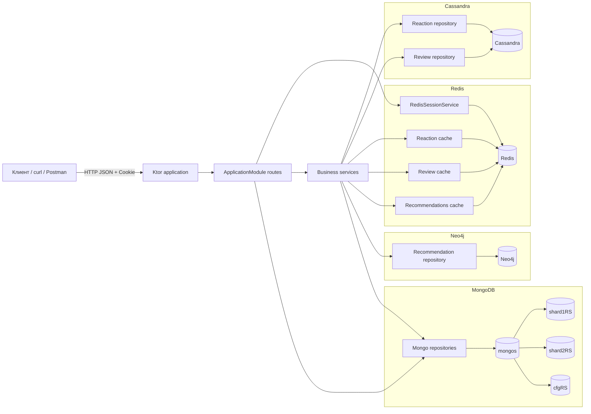
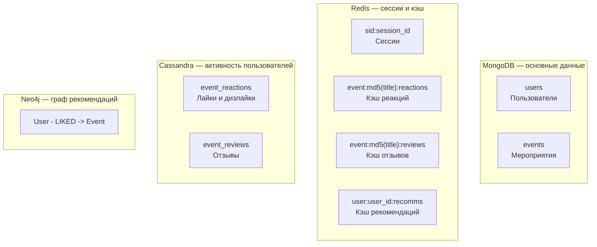

# Backend-сервис платформы мероприятий

[](https://kotlinlang.org/)
[](https://ktor.io/)
[](https://adoptium.net/)
[](.github/workflows/eventhub.yml)
[](#)
[](#)
[](#тестирование)

Учебный backend-сервис для платформы мероприятий, разработанный поэтапно в рамках лабораторных работ по NoSQL. Проект объединяет HTTP API на Kotlin/Ktor, пользовательские сессии, MongoDB, Redis, Cassandra и Neo4j.

Документация рассчитана на нового разработчика, который хочет быстро понять назначение проекта, архитектуру, запуск, конфигурацию и основные сценарии работы.

---

## Содержание

- [Назначение проекта](#назначение-проекта)
- [Технологический стек](#технологический-стек)
- [Архитектура проекта](#архитектура-проекта)
  - [Структура проекта](#структура-проекта)
  - [Схема взаимодействия компонентов](#схема-взаимодействия-компонентов)
  - [Основные сущности и связи](#основные-сущности-и-связи)
  - [Схема хранения данных](#схема-хранения-данных)
- [Функциональные требования и Use Cases](#функциональные-требования-и-use-cases)
- [API](#api)
- [Инструкция по запуску](#инструкция-по-запуску)
- [Конфигурация](#конфигурация)
- [Тестирование](#тестирование)

---

## Назначение проекта

Проект реализует backend для сервиса мероприятий. Пользователь может зарегистрироваться, авторизоваться, создавать мероприятия, искать события и организаторов, оставлять реакции и отзывы, а также получать рекомендации мероприятий на основе лайков других пользователей.

Проект создавался последовательно:

1. **Лабораторная 1** — базовый HTTP-сервис и `GET /health`.
2. **Лабораторная 2** — анонимные server-side сессии на Redis.
3. **Лабораторная 3** — пользователи, авторизация и события в MongoDB.
4. **Лабораторная 4** — поиск, редактирование событий, карточки организаторов, шардирование и репликация MongoDB.
5. **Лабораторная 5** — реакции на мероприятия в Cassandra и Redis.
6. **Лабораторная 6** — отзывы на мероприятия в Cassandra и агрегаты отзывов в Redis.
7. **Лабораторная 7** — рекомендации мероприятий через граф лайков в Neo4j и кэширование рекомендаций в Redis.

Главная учебная цель проекта — показать, как несколько NoSQL-хранилищ могут использоваться в одном сервисе под разные типы данных и разные сценарии доступа.

---

## Технологический стек

| Компонент | Версия / образ | Назначение |
|---|---:|---|
| Kotlin JVM | `2.0.21` | основной язык приложения |
| JDK | `17` | версия JVM для сборки и запуска |
| Ktor Server | `3.2.0` | HTTP-сервер и маршрутизация |
| Netty | через Ktor | runtime HTTP-сервера |
| Gradle Kotlin DSL | wrapper в проекте | система сборки |
| Docker / Docker Compose | compose file | локальный запуск приложения и инфраструктуры |
| MongoDB | `mongo:7.0` | пользователи и мероприятия |
| Redis | `redis:7-alpine` | сессии, кэш реакций, отзывов и рекомендаций |
| Cassandra | `cassandra:latest`, init `cassandra:5.0` | реакции и отзывы |
| Neo4j | `neo4j:5.26` | граф лайков для рекомендаций |
| MongoDB Kotlin Sync Driver | BOM `5.5.0` | подключение к MongoDB |
| Jedis | `5.2.0` | подключение к Redis |
| DataStax Java Driver | `4.17.0` | подключение к Cassandra |
| Neo4j Java Driver | `5.26.0` | подключение к Neo4j |
| kotlinx.serialization | `1.6.3` | JSON-сериализация DTO |
| jBCrypt | `0.4` | хэширование паролей пользователей |
| Logback | `1.4.14` | логирование приложения |

### Используемые базы данных

| База данных | Что хранит | Почему подходит |
|---|---|---|
| Redis | server-side сессии, кэш реакций, кэш отзывов, кэш рекомендаций | быстрое чтение, TTL, hash-структуры |
| MongoDB | пользователи, мероприятия | гибкая документная модель, фильтры, индексы, шардирование |
| Cassandra | реакции и отзывы | запись и чтение больших наборов событийных данных по ключу |
| Neo4j | граф `User` → `LIKED` → `Event` | удобные графовые обходы для рекомендаций |

### Основные библиотеки и их назначение

| Библиотека | Назначение |
|---|---|
| `ktor-server-netty` | запуск HTTP-сервера |
| `ktor-server-core` | базовые серверные API Ktor |
| `ktor-server-content-negotiation` | настройка обработки JSON |
| `ktor-serialization-kotlinx-json` | JSON-сериализация запросов и ответов |
| `mongodb-driver-kotlin-sync` | синхронный доступ к MongoDB |
| `jedis` | работа с Redis |
| `java-driver-core` от DataStax | работа с Cassandra |
| `neo4j-java-driver` | работа с Neo4j |
| `jbcrypt` | безопасное хранение паролей через bcrypt-хэш |
| `logback-classic` | логирование |

---

## Архитектура проекта

Проект построен как монолитный HTTP-сервис с разделением на транспортный слой, сервисы, репозитории, DTO, конфигурацию и утилиты. Все внешние хранилища запускаются локально через Docker Compose.

### Структура проекта

```text
nosqlDB/
├── .env.local                         # env-переменные
├── Dockerfile                         # Docker-образ
├── Makefile                           # команды запуска
├── README.md                          # документация
├── build.gradle.kts                   # Gradle-сборка
├── docker-compose.yml                 # Docker Compose
├── mongo-cluster-init.sh              # init MongoDB
├── scripts/
│   └── cassandra-init.sh              # init Cassandra
└── src/main/kotlin/
    ├── Main.kt                        # точка входа
    ├── config/
    │   ├── AppConfig.kt               # модель конфига
    │   ├── ConfigLoader.kt            # загрузка env
    │   └── DatabaseFactory.kt         # клиенты БД
    ├── dto/
    │   ├── Requests.kt                # request DTO
    │   └── Responses.kt               # response DTO
    ├── model/
    │   ├── EventSearchQuery.kt        # фильтры событий
    │   ├── ReactionCountResult.kt     # счётчики реакций
    │   ├── ReviewSummaryResult.kt     # агрегат отзывов
    │   ├── SessionResult.kt           # результат сессии
    │   └── UserRecord.kt              # модель пользователя
    ├── repository/
    │   ├── CassandraEventReactionRepository.kt  # реакции Cassandra
    │   ├── CassandraEventReviewRepository.kt    # отзывы Cassandra
    │   ├── MongoEventRepository.kt              # события MongoDB
    │   ├── MongoUserRepository.kt               # пользователи MongoDB
    │   └── Neo4jRecommendationRepository.kt     # рекомендации Neo4j
    ├── service/
    │   ├── EventReactionService.kt              # логика реакций
    │   ├── EventReviewService.kt                # логика отзывов
    │   ├── RecommendationService.kt             # логика рекомендаций
    │   ├── RedisEventReactionCache.kt           # кэш реакций
    │   ├── RedisEventReviewCache.kt             # кэш отзывов
    │   ├── RedisRecommendationsCache.kt         # кэш рекомендаций
    │   └── RedisSessionService.kt               # сессии Redis
    ├── transport/
    │   └── ApplicationModule.kt       # HTTP routes
    └── utils/
        ├── DocumentMapping.kt         # маппинг DTO
        ├── SessionCookies.kt          # cookie-сессии
        ├── SidGenerator.kt            # генерация sid
        └── Validation.kt              # валидация
```

### Назначение слоёв

| Слой | Где находится | Ответственность |
|---|---|---|
| Transport | `transport/ApplicationModule.kt` | HTTP routes, чтение query/path/body, статусы ответов |
| DTO | `dto/` | формат входящих JSON-запросов и исходящих JSON-ответов |
| Service | `service/` | бизнес-логика, кэширование, связка нескольких репозиториев |
| Repository | `repository/` | работа с конкретными хранилищами данных |
| Config | `config/` | загрузка env и создание подключений к БД |
| Utils | `utils/` | Cookie, sid, валидация, преобразование документов |

### Схема взаимодействия компонентов



### Основные сущности и связи

#### User

Пользователь системы. Хранится в MongoDB в коллекции `users`.

```json
{
  "full_name": "Иван Иванов",
  "username": "ivan_ivanov",
  "password_hash": "$2a$10$..."
}
```

Особенности:

- `username` уникален;
- пароль хранится только в виде bcrypt-хэша;
- наружу возвращаются только `id`, `full_name`, `username`;
- `password_hash` никогда не должен попадать в API-ответы.

#### Session

Server-side сессия в Redis. Используется для анонимного и авторизованного состояния.

```text
sid:{session_id}
```

Пример значения Redis Hash:

```json
{
  "created_at": "2026-03-14T14:59:32Z",
  "updated_at": "2026-03-14T15:05:10Z",
  "user_id": "65e9c0b1a2b3c4d5e6f7a8b9"
}
```

Особенности:

- идентификатор сессии передаётся в Cookie `X-Session-Id`;
- sid генерируется как 128-битное случайное значение в hex;
- TTL задаётся через `APP_USER_SESSION_TTL`;
- `GET /health` не создаёт и не продлевает сессию;
- `POST /session` создаёт или продлевает сессию.

#### Event

Мероприятие. Хранится в MongoDB в коллекции `events`.

```json
{
  "title": "Мой день рождения",
  "category": "party",
  "price": 0,
  "description": "Небольшая встреча друзей",
  "location": {
    "city": "Москва",
    "address": "г. Москва, ул. Пушкина, дом Колотушкина"
  },
  "created_at": "2026-03-14T14:59:32+03:00",
  "created_by": "65e9c0b1a2b3c4d5e6f7a8b9",
  "started_at": "2026-04-01T12:00:00+03:00",
  "finished_at": "2026-04-01T23:00:00+03:00"
}
```

Связи:

- `Event.created_by` ссылается на `User.id`;
- только автор события может редактировать мероприятие;
- события можно искать по названию, id, категории, цене, городу, датам и организатору.

#### EventReaction

Реакция пользователя на мероприятие. Хранится в Cassandra в таблице `event_reactions`.

```text
event_reactions
```

Поля:

| Поле | Тип | Назначение |
|---|---|---|
| `event_id` | `text` | id мероприятия в MongoDB |
| `created_by` | `text` | id пользователя в MongoDB |
| `like_value` | `tinyint` | `1` для лайка, `-1` для дизлайка |
| `created_at` | `timestamp` | дата создания/обновления реакции |

Особенности:

- один пользователь может иметь только одну реакцию на одно мероприятие;
- повторный лайк обновляет дату;
- лайк после дизлайка меняет значение на `1`;
- дизлайк после лайка меняет значение на `-1`;
- агрегированные счётчики кэшируются в Redis.

#### EventReview

Отзыв пользователя на мероприятие. Хранится в Cassandra в таблице `event_reviews`.

Поля:

| Поле | Тип | Назначение |
|---|---|---|
| `event_id` | `text` | id мероприятия в MongoDB |
| `created_by` | `text` | id пользователя в MongoDB |
| `id` | `uuid` | id отзыва |
| `rating` | `tinyint` | оценка от 1 до 5 |
| `comment` | `text` | комментарий, максимум 300 символов |
| `created_at` | `timestamp` | дата создания |
| `updated_at` | `timestamp` | дата последнего обновления |

Особенности:

- один пользователь может оставить один отзыв на конкретный `event_id`;
- редактировать отзыв может только его автор;
- агрегаты отзывов кэшируются в Redis по ключу `event:{event_title_md5_hash}:reviews`, где `event_title_md5_hash` — MD5-хэш названия мероприятия.

#### Recommendation graph

Граф рекомендаций хранится в Neo4j.

Узлы:

- `User` — пользователь, поле `id` равно MongoDB id;
- `Event` — мероприятие, поля `id` и `title`.

Связь:

```text
(:User)-[:LIKED]->(:Event)
```

Алгоритм рекомендаций:

1. Берутся события, которые лайкнул текущий пользователь.
2. Находятся другие пользователи, лайкнувшие эти же события.
3. Берутся события, которые лайкнули похожие пользователи.
4. Из результата исключаются события, уже лайкнутые текущим пользователем.
5. Рекомендации сортируются по релевантности / популярности.
6. Если несколько событий имеют одинаковое название, возвращается ближайшее по `started_at`.

### Схема хранения данных



### MongoDB: репликация и шардирование

MongoDB запускается как шардированный кластер:

- `cfgRS` — replica set config servers из трёх узлов: `configsvr1`, `configsvr2`, `configsvr3`;
- `shard1RS` — первый shard replica set из трёх узлов: `shard1a`, `shard1b`, `shard1c`;
- `shard2RS` — второй shard replica set из трёх узлов: `shard2a`, `shard2b`, `shard2c`;
- `mongos` — router, через который приложение подключается к MongoDB;
- коллекция `${MONGODB_DATABASE}.events` шардируется по хэш-ключу `created_by`.

Скрипт `mongo-cluster-init.sh`:

- ожидает доступность всех MongoDB-контейнеров;
- инициализирует replica sets;
- ждёт появления primary в каждом replica set;
- добавляет шарды в `mongos`;
- включает sharding для базы `MONGODB_DATABASE`;
- шардирует коллекцию `events` по hashed-ключу `created_by`;
- создаёт пользователя приложения, если заданы `MONGODB_USER` и `MONGODB_PASSWORD`.

### Cassandra: таблицы

Скрипт `scripts/cassandra-init.sh` создаёт keyspace и таблицы.

```sql
CREATE TABLE IF NOT EXISTS event_reactions (
    event_id text,
    created_by text,
    like_value tinyint,
    created_at timestamp,
    PRIMARY KEY ((event_id), created_by)
);

CREATE INDEX IF NOT EXISTS event_reactions_like_value_idx
ON event_reactions (like_value);

CREATE INDEX IF NOT EXISTS event_reactions_created_by_idx
ON event_reactions (created_by);

CREATE TABLE IF NOT EXISTS event_reviews (
    event_id text,
    created_by text,
    id uuid,
    rating tinyint,
    comment text,
    created_at timestamp,
    updated_at timestamp,
    PRIMARY KEY ((event_id), created_by)
);

CREATE INDEX IF NOT EXISTS event_reviews_id_idx
ON event_reviews (id);
```

### Redis: ключи

| Данные | Формат ключа | Тип Redis | TTL |
|---|---|---|---|
| Сессия | `sid:{session_id}` | Hash | `APP_USER_SESSION_TTL` |
| Реакции мероприятия | `event:{event_title_md5_hash}:reactions` | Hash | `APP_LIKE_TTL` |
| Агрегат отзывов | `event:{event_title_md5_hash}:reviews` | Hash | `APP_EVENT_REVIEWS_TTL` |
| Рекомендации пользователя | `user:{user_id}:recomms` | Hash | `APP_RECOMMENDATIONS_TTL` |

---

## Функциональные требования и Use Cases

### UC-1. Проверить, что сервис работает

**Кто использует:** разработчик, CI, внешний мониторинг.  
**Что происходит:** отправить `GET /health`, получить `200 OK` и `{ "status": "ok" }`.  
**Зачем нужно:** можно быстро понять, что HTTP-сервис поднялся.

### UC-2. Создать или продлить анонимную сессию

**Кто использует:** анонимный пользователь.  
**Что происходит:** отправить `POST /session`. Если Cookie нет, сервис создаёт новую сессию и возвращает `201 Created`; если Cookie есть и сессия жива, сервис продлевает TTL и возвращает `200 OK`.  
**Зачем нужно:** сервис может хранить состояние пользователя на сервере, не нарушая stateless-подход HTTP на уровне клиента.

### UC-3. Зарегистрировать пользователя

**Кто использует:** анонимный пользователь с сессией.  
**Что происходит:** отправить `POST /users` с `full_name`, `username`, `password`. Сервис создаёт пользователя в MongoDB, сохраняет bcrypt-хэш пароля, создаёт новую сессию и привязывает её к пользователю. Для рекомендательного графа также создаётся узел пользователя в Neo4j.  
**Зачем нужно:** пользователь получает аккаунт и может создавать мероприятия.

### UC-4. Войти и выйти из аккаунта

**Кто использует:** зарегистрированный пользователь.  
**Что происходит:** пользователь отправляет `POST /auth/login` с логином и паролем, после успешной проверки сессия связывается с `user_id`. Для выхода вызывается `POST /auth/logout`, Redis-сессия удаляется, Cookie истекает.  
**Зачем нужно:** пользователь может выполнять защищённые действия только после авторизации.

### UC-5. Создать мероприятие

**Кто использует:** авторизованный пользователь.  
**Что происходит:** отправить `POST /events` с названием, адресом, датой начала, датой окончания и описанием. Сервис сохраняет событие в MongoDB с `created_by`. Для рекомендательного графа также создаётся узел события в Neo4j.  
**Зачем нужно:** организатор публикует мероприятие.

### UC-6. Найти мероприятия

**Кто использует:** любой пользователь.  
**Что происходит:** отправить `GET /events` с фильтрами `title`, `id`, `category`, `price_from`, `price_to`, `city`, `date_from`, `date_to`, `user`, `limit`, `offset`.  
**Зачем нужно:** посетитель может найти интересные мероприятия по параметрам.

### UC-7. Посмотреть карточку мероприятия

**Кто использует:** любой пользователь.  
**Что происходит:** отправить `GET /events/{id}`. При переданном query-параметре `include` со значениями `reactions` и/или `reviews` сервис добавляет агрегированные реакции и отзывы.  
**Зачем нужно:** пользователь получает подробное описание события и социальные метрики.

### UC-8. Отредактировать мероприятие

**Кто использует:** авторизованный организатор мероприятия.  
**Что происходит:** отправить `PATCH /events/{id}` с `category`, `price` и/или `city`. Сервис проверяет, что текущий пользователь является автором мероприятия.  
**Зачем нужно:** организатор может актуализировать данные мероприятия.

### UC-9. Найти организаторов и их события

**Кто использует:** любой пользователь.  
**Что происходит:** вызвать `GET /users`, `GET /users/{id}` или `GET /users/{id}/events`.  
**Зачем нужно:** можно найти организатора и посмотреть его мероприятия.

### UC-10. Поставить лайк или дизлайк

**Кто использует:** авторизованный пользователь.  
**Что происходит:** вызвать `POST /events/{event_id}/like` или `POST /events/{event_id}/dislike`. Реакция сохраняется в Cassandra, а счётчики реакций читаются через Redis-кэш по Cache-Aside. Лайк также добавляет связь `LIKED` в Neo4j для рекомендаций; последующий дизлайк не удаляет эту связь из рекомендательного графа.  
**Зачем нужно:** сервис собирает обратную связь и данные для рекомендаций.

### UC-11. Добавить и изменить отзыв

**Кто использует:** авторизованный пользователь.  
**Что происходит:** вызвать `POST /events/{event_id}/reviews` с `comment` и `rating`; при необходимости изменить свой отзыв через `PATCH /events/{event_id}/reviews/{review_id}`.  
**Зачем нужно:** пользователь оставляет содержательную обратную связь, а сервис показывает агрегированный рейтинг.

### UC-12. Получить рекомендации

**Кто использует:** авторизованный пользователь.  
**Что происходит:** вызвать `GET /recommendations`. Сервис сначала проверяет Redis-кэш, затем при промахе строит рекомендации через Neo4j и возвращает список событий из MongoDB.  
**Зачем нужно:** пользователь получает персонализированную подборку мероприятий.

---

## API

API-спецификация проекта описана в формате OpenAPI 3.1 и находится в файле:

```text
api/openapi.yaml
```

Спецификация покрывает все HTTP endpoints проекта: healthcheck, сессии, пользователей, авторизацию, мероприятия, реакции, отзывы и рекомендации.

### Как открыть Swagger UI локально

Если проект уже запущен на `localhost:8080`, Swagger UI можно открыть отдельным Docker-контейнером:

```bash
docker run --rm -p 8081:8080 \
  -e SWAGGER_JSON=/api/openapi.yaml \
  -v ${PWD}/api:/api \
  swaggerapi/swagger-ui
```

После запуска Swagger UI будет доступен по адресу:

```text
http://localhost:8081
```

> В Windows PowerShell команда будет такой:

```powershell
docker run --rm -p 8081:8080 `
  -e SWAGGER_JSON=/api/openapi.yaml `
  -v ${PWD}/api:/api `
  swaggerapi/swagger-ui
```

### Что описано в спецификации

- список всех endpoints;
- HTTP-методы и path/query-параметры;
- request body для `POST` и `PATCH` endpoints;
- основные успешные и ошибочные ответы;
- JSON-схемы DTO;
- Cookie-авторизация через `X-Session-Id`;
- примеры запросов и ответов.

### Сводная таблица endpoints

| Метод | Endpoint | Авторизация | Назначение |
|---|---|---|---|
| `GET` | `/` | нет | корневой маршрут |
| `GET` | `/health` | нет | healthcheck |
| `POST` | `/session` | нет | создать или продлить анонимную сессию |
| `POST` | `/users` | нет / создаёт сессию | регистрация пользователя |
| `GET` | `/users` | нет | поиск организаторов |
| `GET` | `/users/{id}` | нет | карточка организатора |
| `GET` | `/users/{id}/events` | нет | мероприятия организатора |
| `POST` | `/auth/login` | нет | вход пользователя |
| `POST` | `/auth/logout` | cookie-сессия | выход пользователя |
| `POST` | `/events` | авторизованный пользователь | создать мероприятие |
| `GET` | `/events` | нет | поиск мероприятий |
| `GET` | `/events/{id}` | нет | карточка мероприятия |
| `PATCH` | `/events/{id}` | автор мероприятия | редактировать мероприятие |
| `POST` | `/events/{event_id}/like` | авторизованный пользователь | поставить лайк |
| `POST` | `/events/{event_id}/dislike` | авторизованный пользователь | поставить дизлайк |
| `POST` | `/events/{event_id}/reviews` | авторизованный пользователь | оставить отзыв |
| `GET` | `/events/{event_id}/reviews` | нет | получить отзывы мероприятия |
| `PATCH` | `/events/{event_id}/reviews/{review_id}` | автор отзыва | изменить отзыв |
| `GET` | `/recommendations` | авторизованный пользователь | получить рекомендации |

### Query-параметры

#### `GET /events`

| Параметр | Тип | Назначение |
|---|---|---|
| `title` | string | поиск по подстроке в названии |
| `id` | string | точный поиск по id мероприятия |
| `category` | string | `meetup`, `concert`, `exhibition`, `party`, `other` |
| `price_from` | uint | минимальная цена включительно |
| `price_to` | uint | максимальная цена включительно |
| `city` | string | город проведения |
| `date_from` | string | дата начала не раньше, формат `YYYYMMDD` |
| `date_to` | string | дата начала не позже, формат `YYYYMMDD` |
| `user` | string | username организатора, точное совпадение |
| `include` | string | `reactions`, `reviews` или `reactions,reviews` |
| `limit` | uint | максимальный размер выборки |
| `offset` | uint | сколько записей пропустить |

#### `GET /users`

| Параметр | Тип | Назначение |
|---|---|---|
| `id` | string | точный поиск по id пользователя |
| `name` | string | поиск по вхождению в `full_name` |
| `limit` | uint | максимальный размер выборки |
| `offset` | uint | сколько записей пропустить |

#### `GET /events/{event_id}/reviews`

| Параметр | Тип | Назначение |
|---|---|---|
| `limit` | uint | максимальное количество отзывов |
| `offset` | uint | сколько отзывов пропустить |

### Примеры запросов и ответов

#### 1. Healthcheck

Запрос:

```bash
curl -i http://localhost:8080/health
```

Ответ:

```http
HTTP/1.1 200 OK
Content-Type: application/json
```

```json
{
  "status": "ok"
}
```

#### 2. Создать анонимную сессию

Запрос:

```bash
curl -i -X POST http://localhost:8080/session \
  -c cookies.txt -b cookies.txt
```

Ответ при первом визите:

```http
HTTP/1.1 201 Created
Set-Cookie: X-Session-Id=3f8a2c1d9e4b7f0a5c6d2e8b1a3f9c7d; HttpOnly; Path=/; Max-Age=60
Content-Length: 0
```

Ответ при повторном визите:

```http
HTTP/1.1 200 OK
Set-Cookie: X-Session-Id=3f8a2c1d9e4b7f0a5c6d2e8b1a3f9c7d; HttpOnly; Path=/; Max-Age=60
Content-Length: 0
```

#### 3. Зарегистрировать пользователя

Запрос:

```bash
curl -i -X POST http://localhost:8080/users \
  -H "Content-Type: application/json" \
  -c cookies.txt -b cookies.txt \
  -d '{
    "full_name": "Иван Иванов",
    "username": "ivan_ivanov",
    "password": "strong_password"
  }'
```

Ответ:

```http
HTTP/1.1 201 Created
Set-Cookie: X-Session-Id=...; HttpOnly; Path=/; Max-Age=60
Content-Length: 0
```

Ошибка, если пользователь уже есть:

```json
{
  "message": "user already exists"
}
```

#### 4. Войти в аккаунт

Запрос:

```bash
curl -i -X POST http://localhost:8080/auth/login \
  -H "Content-Type: application/json" \
  -c cookies.txt -b cookies.txt \
  -d '{
    "username": "ivan_ivanov",
    "password": "strong_password"
  }'
```

Ответ:

```http
HTTP/1.1 204 No Content
Set-Cookie: X-Session-Id=...; HttpOnly; Path=/; Max-Age=60
Content-Length: 0
```

#### 5. Создать мероприятие

Запрос:

```bash
curl -i -X POST http://localhost:8080/events \
  -H "Content-Type: application/json" \
  -c cookies.txt -b cookies.txt \
  -d '{
    "title": "Мой день рождения",
    "address": "г. Москва, ул. Пушкина, дом Колотушкина",
    "started_at": "2026-04-01T12:00:00+03:00",
    "finished_at": "2026-04-01T23:00:00+03:00",
    "description": "Небольшая встреча друзей"
  }'
```

Ответ:

```json
{
  "id": "12e9c0b1a2b3c3d5e6f7a8b7"
}
```

#### 6. Получить мероприятия с реакциями и отзывами

Запрос:

```bash
curl -s "http://localhost:8080/events?include=reactions,reviews&limit=10" \
  -c cookies.txt -b cookies.txt
```

Ответ:

```json
{
  "events": [
    {
      "id": "12e9c0b1a2b3c3d5e6f7a8b7",
      "title": "Мой день рождения",
      "category": "party",
      "price": 0,
      "description": "Небольшая встреча друзей",
      "location": {
        "city": "Москва",
        "address": "г. Москва, ул. Пушкина, дом Колотушкина"
      },
      "created_at": "2026-03-14T14:59:32+03:00",
      "created_by": "65e9c0b1a2b3c4d5e6f7a8b9",
      "started_at": "2026-04-01T12:00:00+03:00",
      "finished_at": "2026-04-01T23:00:00+03:00",
      "reactions": {
        "likes": 24,
        "dislikes": 3
      },
      "reviews": {
        "count": 3,
        "rating": 4.7
      }
    }
  ],
  "count": 1
}
```

#### 7. Отредактировать мероприятие

Запрос:

```bash
curl -i -X PATCH http://localhost:8080/events/12e9c0b1a2b3c3d5e6f7a8b7 \
  -H "Content-Type: application/json" \
  -c cookies.txt -b cookies.txt \
  -d '{
    "category": "concert",
    "price": 1000,
    "city": "Москва"
  }'
```

Ответ:

```http
HTTP/1.1 204 No Content
Content-Length: 0
```

#### 8. Поставить лайк

Запрос:

```bash
curl -i -X POST http://localhost:8080/events/12e9c0b1a2b3c3d5e6f7a8b7/like \
  -c cookies.txt -b cookies.txt
```

Ответ:

```http
HTTP/1.1 204 No Content
Content-Length: 0
```

#### 9. Добавить отзыв

Запрос:

```bash
curl -i -X POST http://localhost:8080/events/12e9c0b1a2b3c3d5e6f7a8b7/reviews \
  -H "Content-Type: application/json" \
  -c cookies.txt -b cookies.txt \
  -d '{
    "comment": "Отличное мероприятие",
    "rating": 5
  }'
```

Ответ:

```json
{
  "id": "069b9830-4b5f-487a-ae89-424619ca2a35"
}
```

#### 10. Получить отзывы мероприятия

Запрос:

```bash
curl -s "http://localhost:8080/events/12e9c0b1a2b3c3d5e6f7a8b7/reviews?limit=10&offset=0"
```

Ответ:

```json
{
  "reviews": [
    {
      "id": "069b9830-4b5f-487a-ae89-424619ca2a35",
      "event_id": "12e9c0b1a2b3c3d5e6f7a8b7",
      "comment": "Отличное мероприятие",
      "created_at": "2026-03-14T14:59:32Z",
      "created_by": "65e9c0b1a2b3c4d5e6f7a8b9",
      "rating": 5,
      "updated_at": "2026-03-14T14:59:32Z"
    }
  ],
  "count": 1
}
```

#### 11. Получить рекомендации

Запрос:

```bash
curl -s http://localhost:8080/recommendations \
  -c cookies.txt -b cookies.txt
```

Ответ:

```json
{
  "events": [
    {
      "id": "12e9c0b1a2b3c3d5e6f7a8b7",
      "title": "Выставка российского зодчества",
      "category": "exhibition",
      "price": 0,
      "description": "Описание мероприятия",
      "location": {
        "city": "Москва",
        "address": "г. Москва, ул. Пушкина, дом Колотушкина"
      },
      "created_at": "2026-03-14T14:59:32+03:00",
      "created_by": "65e9c0b1a2b3c4d5e6f7a8b9",
      "started_at": "2026-04-01T12:00:00+03:00",
      "finished_at": "2026-04-01T23:00:00+03:00"
    }
  ]
}
```

Если рекомендаций нет:

```json
{
  "events": []
}
```

---

## Инструкция по запуску

### Требования к окружению

Для запуска через Docker нужны:

- Docker;
- Docker Compose;
- Make, если используется команда `make run`;
- свободные порты `8080`, `6379`, `27017`, `9042`, `7474`, `7687`, а также MongoDB-порты, указанные в `docker-compose.yml`.

### Быстрый запуск

1. Перейти в корень проекта:

```bash
cd nosqlDB
```

2. Проверить наличие `.env.local`:

```bash
ls .env.local
```

3. Запустить приложение и инфраструктуру:

```bash
make run
```

Эквивалент без Makefile:

```bash
docker compose --env-file .env.local up -d --build
```

4. Проверить состояние контейнеров:

```bash
docker compose --env-file .env.local ps
```

5. Проверить healthcheck:

```bash
curl http://localhost:8080/health
```

Ожидаемый ответ:

```json
{"status":"ok"}
```

6. Остановить проект:

```bash
make stop
```

Эквивалент без Makefile:

```bash
docker compose --env-file .env.local down
```

### Полная очистка данных Docker volumes

Обычная команда `make stop` останавливает контейнеры, но не удаляет все volume с данными. Если нужно полностью пересоздать MongoDB/Cassandra/Redis/Neo4j с нуля, можно выполнить:

```bash
docker compose --env-file .env.local down -v
```

После этого следующий запуск снова выполнит инициализацию MongoDB-кластера и Cassandra-схемы.

### Проверка сервисов после запуска

| Что проверить | Команда / URL |
|---|---|
| HTTP API | `curl http://localhost:8080/health` |
| Redis | `docker compose exec redis redis-cli ping` |
| MongoDB через mongos | `docker compose exec mongos mongosh --eval 'db.adminCommand({ ping: 1 })'` |
| Cassandra | `docker compose exec cassandra-dc1-node1 cqlsh -e 'DESCRIBE KEYSPACES'` |
| Neo4j Browser | `http://localhost:7474` |

### Возможные проблемы запуска

| Проблема | Что проверить |
|---|---|
| `app` не стартует | логи `docker compose logs app` |
| Cassandra долго в статусе healthcheck | дождаться инициализации; Cassandra может стартовать дольше остальных сервисов |
| MongoDB setup падает | проверить `docker compose logs mongo-setup` |
| порт занят | изменить порт в `.env.local` или остановить конфликтующий сервис |
| приложение не видит MongoDB | проверить `MONGODB_HOST=mongos` и `MONGODB_PORT=27017` внутри Docker Compose |
| нет рекомендаций | нужны пользователи, события и лайки, чтобы в Neo4j появился граф |

---

## Конфигурация

Все параметры задаются через `.env.local` и прокидываются в контейнер приложения через `docker-compose.yml`.

| Переменная | Описание | Значение по умолчанию / пример |
|---|---|---|
| `APP_HOST` | Хост, на котором Ktor слушает запросы внутри контейнера | `0.0.0.0` |
| `APP_PORT` | HTTP-порт приложения | `8080` |
| `APP_USER_SESSION_TTL` | TTL пользовательской сессии в Redis, секунды | `60` |
| `REDIS_HOST` | Хост Redis внутри Docker Compose сети | `redis` |
| `REDIS_PORT` | Порт Redis | `6379` |
| `REDIS_PASSWORD` | Пароль Redis, если используется | пусто |
| `REDIS_DB` | Номер Redis DB | `0` |
| `MONGODB_DATABASE` | Имя базы MongoDB приложения | `mongoDBLab4` |
| `MONGODB_USER` | Пользователь MongoDB приложения | `lab4_user` |
| `MONGODB_PASSWORD` | Пароль пользователя MongoDB | `lab4_password` |
| `MONGODB_HOST` | Хост MongoDB router | `mongos` |
| `MONGODB_PORT` | Порт `mongos` | `27017` |
| `MONGODB_ROOT_USER` | Root-пользователь для инициализации MongoDB | `root` |
| `MONGODB_ROOT_PASSWORD` | Пароль root-пользователя MongoDB | `rootpassword` |
| `CASSANDRA_HOSTS` | Список Cassandra-хостов через запятую | `cassandra-dc1-node1` |
| `CASSANDRA_PORT` | Порт Cassandra | `9042` |
| `CASSANDRA_USERNAME` | Пользователь Cassandra, если включена auth | пусто |
| `CASSANDRA_PASSWORD` | Пароль Cassandra, если включена auth | пусто |
| `CASSANDRA_KEYSPACE` | Keyspace для таблиц реакций и отзывов | `testkeyspace` |
| `CASSANDRA_CONSISTENCY` | Consistency level Cassandra | `ONE` |
| `APP_LIKE_TTL` | TTL кэша реакций в Redis, секунды | `60` |
| `APP_EVENT_REVIEWS_TTL` | TTL кэша агрегатов отзывов в Redis, секунды | `120` |
| `NEO4J_URL` | Bolt URL Neo4j для приложения | `bolt://neo4j:7687` |
| `NEO4J_HOST` | Хост Neo4j внутри Docker Compose сети | `neo4j` |
| `NEO4J_BOLT_PORT` | Bolt-порт Neo4j, проброшенный наружу | `7687` |
| `NEO4J_USERNAME` | Пользователь Neo4j | `neo4j` |
| `NEO4J_PASSWORD` | Пароль Neo4j | `password` |
| `APP_RECOMMENDATIONS_TTL` | TTL кэша рекомендаций в Redis, секунды | `60` |

Пример `.env.local`:

```env
APP_HOST=0.0.0.0
APP_PORT=8080
APP_USER_SESSION_TTL=60

REDIS_HOST=redis
REDIS_PORT=6379
REDIS_PASSWORD=
REDIS_DB=0

MONGODB_DATABASE=mongoDBLab4
MONGODB_USER=lab4_user
MONGODB_PASSWORD=lab4_password
MONGODB_HOST=mongos
MONGODB_PORT=27017

MONGODB_ROOT_USER=root
MONGODB_ROOT_PASSWORD=rootpassword

CASSANDRA_HOSTS=cassandra-dc1-node1
CASSANDRA_PORT=9042
CASSANDRA_USERNAME=
CASSANDRA_PASSWORD=
CASSANDRA_KEYSPACE=testkeyspace
CASSANDRA_CONSISTENCY=ONE
APP_LIKE_TTL=60

NEO4J_URL=bolt://neo4j:7687
NEO4J_HOST=neo4j
NEO4J_BOLT_PORT=7687
NEO4J_USERNAME=neo4j
NEO4J_PASSWORD=password

APP_RECOMMENDATIONS_TTL=60
APP_EVENT_REVIEWS_TTL=120
```

---

## Тестирование

В проекте не добавлялись отдельные локальные unit-тесты или интеграционные тесты.

Проверка лабораторных работ выполняется автоматически через GitHub Actions с использованием autograder из репозитория [`ndbx`](https://github.com/sitnikovik/ndbx). Автоматическая проверка запускается при создании Pull Request и проверяет соответствие реализации требованиям лабораторных работ: запуск сервиса, доступность эндпоинтов, корректность HTTP-статусов, форматов запросов и ответов, работу с Cookie, Redis, MongoDB, Cassandra и Neo4j.

Чтобы запустить стандартную проверку через CI, нужно создать Pull Request в основную ветку репозитория. После этого GitHub Actions автоматически запустит workflow проверки.

### Что покрывается проверками курса

Автоматическая проверка лабораторных работ проверяет соответствие реализации требованиям этапов:

| Область | Что проверяется |
|---|---|
| Healthcheck | `GET /health`, статус `200`, JSON `{ "status": "ok" }` |
| Запуск | проект поднимается через `make run` / Docker Compose |
| Сессии | создание, продление, TTL, Cookie `X-Session-Id`, Redis Hash |
| Пользователи | регистрация, уникальность username, bcrypt password hash, login/logout |
| События | создание, поиск, фильтры, карточка события, редактирование владельцем |
| MongoDB | структура документов, индексы, шардирование `events`, replica set |
| Реакции | лайк/дизлайк, Cassandra, Redis cache-aside, include `reactions` |
| Отзывы | создание, просмотр, редактирование, агрегаты в Redis, include `reviews` |
| Рекомендации | Neo4j graph, исключение уже лайкнутых, Redis-кэш рекомендаций |

### Ручной smoke-test после запуска

```bash
curl -i http://localhost:8080/health

curl -i -X POST http://localhost:8080/session \
  -c cookies.txt -b cookies.txt

curl -i -X POST http://localhost:8080/users \
  -H "Content-Type: application/json" \
  -c cookies.txt -b cookies.txt \
  -d '{"full_name":"Иван Иванов","username":"ivan_ivanov","password":"strong_password"}'

curl -i -X POST http://localhost:8080/events \
  -H "Content-Type: application/json" \
  -c cookies.txt -b cookies.txt \
  -d '{"title":"Мой день рождения","address":"г. Москва, ул. Пушкина, дом Колотушкина","started_at":"2026-04-01T12:00:00+03:00","finished_at":"2026-04-01T23:00:00+03:00","description":"Небольшая встреча друзей"}'

curl -s "http://localhost:8080/events?include=reactions,reviews&limit=10" \
  -c cookies.txt -b cookies.txt
```

